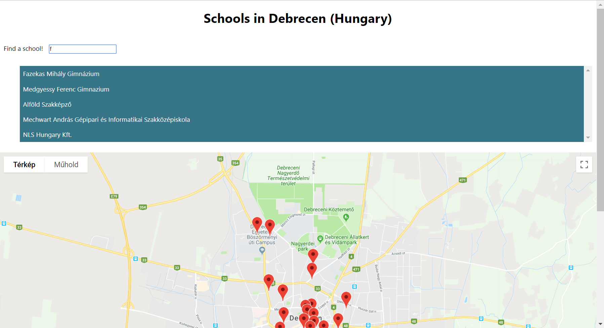

# Neighborhood Map Project

## Overview
The project has been created as part of Udacity's Frontend Web Developer Nanodegree course.
It is a single page application made by React. It shows schools in the city of Debrecen (Hungary) where I live.
The application uses [Google Maps API](https://developers.google.com/maps/documentation/javascript/tutorial) to display a map, and [Foursquare API](https://developer.foursquare.com) to get info about the places.

## Screenshots

## Prerequisites
* [nmp](https://www.npmjs.com/)
* [Node](https://nodejs.org/en/)

## Installing
1. Download the repository on your local computer.
2. Open a terminal and navigate to project folder.
3. Run:
`npm install`
4. Upon finish run:
`npm start`
This opens [localhost:3000](localhost:3000) in your browser window.
5. Start searching for schools in the area.

## Resources used to create the application
* This project was bootstrapped with [Create React App](https://github.com/facebookincubator/create-react-app). You can find more information on how to perform common tasks [here](https://github.com/facebookincubator/create-react-app/blob/master/packages/react-scripts/template/README.md)
* Study session by [Doug Brown](https://www.youtube.com/watch?v=NVAVLCJwAAo&feature=youtu.be)
* Study sesssion by [Elharony](https://www.youtube.com/watch?v=ywdxLNjhBYw) which was a great help for me not to overcomplicate this project
* [React documentation](https://reactjs.org/)
* Slack channel of fellow Udacity students

## Licences
The content of this repository is free and is licensed under a [MIT License](https://choosealicense.com/licenses/mit/).

## Contributing
This repository is my personal project developed during Udacity's Front-end Web Developer Nanodegree Program. I appreciate any useful tips for further improvements of the application.
